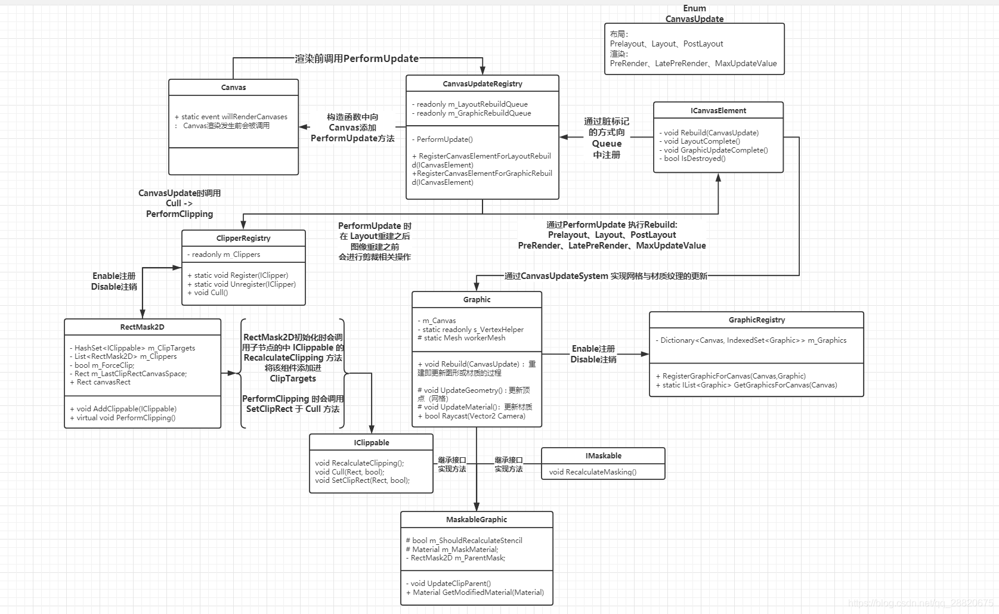

### UGUI-Graphic




#### 一、 CanvasUpdateSystem 画布刷新系统

##### ICanvasElement

- 重建方法：void Rebuild(CanvasUpdate exectuing)；
- 布局重建完成：void LayoutComplete();
- 图像重建完成：void GraphicUpdateComplete();
- 检查Element是否无效：bool isDestoryed();


##### Canvas

Canvas渲染前会调用`static event willRenderCanvases` 事件


##### CanvasUpdateRegistry

管理两个队列：

1. LayoutRebuildQueue：布局重建队列
2. GraphicRebuildQueue：图像重建队列

CanvasUpdateRegistry被初始化时（构造函数）向Canvas中注册了更新函数（PerformUpdate），以用来响应重建。

`Canvas.willRenderCanvases += PerformUpdate;`

Canvas在渲染前会调用willRenderCanvases，即执行PerformUpdate，流程如下：

- **更新布局**，根据父节点多少排序，由内向外更新。更新类型依次为 Prelayout、Layout、PostLayout（enum CanvasUpdate）
- 通知布局更新完成
- **ClipperRegistry进行剪裁**

- **更新图像**，依次 PreRender、LatePreRender、MaxUpdateValue
- 通知图像更新完成


##### 脏标记模式

标记延迟执行，优化重新渲染的手段。

详情请见：[游戏设计模式：脏标记模式](https://gpp.tkchu.me/dirty-flag.html)

在Graphic中存在三种脏标记分别表示三种等待重建：

- 尺寸改变时（RectTransformDimensions）：LayoutRebuild 布局重建
- 尺寸、颜色改变时：Vertices to GraphicRebuild 图像重建
- 材质改变时：Material to GraphicRebuild 图像重建

层级改变、应用动画属性（DidApplyAnimationProperties）：All to Rebuild 重建所有


#### 二、 Graphic

Graphic作为图像组件的基类，主要实现了网格与图像的生成/刷新方法。

在生命周期Enable阶段、Editor模式下的OnValidate中，层级/颜色/材质改变时都会进行相应的重建，重建过程主要通过CanvasUpdateSystem最终被Canvas所重新渲染。

重建主要分为两个部分：顶点重建（UpdateGeometry）与材质重建（UpdateMaterial）

更新完成的结果会设置进CanvasRenderer，从而被渲染形成图像。


##### GraphicRegistry

管理同Canvas下的所有Graphic对象。

`Dictionary<Canvas, IndexedSet<Graphic>> m_Graphics`

Graphic 初始化时（Enable）会寻找其最近根节点的**Canvas**组件，并以此存为key存储在**GraphicRegistry**中。


##### Rebulid

```C#
public virtual void Rebuild(CanvasUpdate update)
{
    if (canvasRenderer == null || canvasRenderer.cull)
        return;

    switch (update)
    {
        case CanvasUpdate.PreRender:
            if (m_VertsDirty)
            {
                UpdateGeometry(); // 网格更新
                m_VertsDirty = false;
            }
            if (m_MaterialDirty)
            {
                UpdateMaterial(); // 材质更新
                m_MaterialDirty = false;
            }
            break;
    }
}
```


##### UpdateGeometry

Graphic 顶点（网格）更新，发生**顶点重建**时会被调用。

过程：

- 更新VertextHelper数据
- 遍历身上的IMeshModifier组件（MeshEffect组件，实现网格特效，例如Shadow、Outline），更新VertextHelper数据
- 将最终的顶点数据设置给workerMesh，并将workerMesh设置进canvasRenderer中，进行渲染

```C#
private void DoMeshGeneration()
{
    if (rectTransform != null && rectTransform.rect.width >= 0 && rectTransform.rect.height >= 0)
        OnPopulateMesh(s_VertexHelper); // 更新顶点信息
    else
        s_VertexHelper.Clear(); // clear the vertex helper so invalid graphics dont draw.

    var components = ListPool<Component>.Get();
    GetComponents(typeof(IMeshModifier), components);

    for (var i = 0; i < components.Count; i++)
        ((IMeshModifier)components[i]).ModifyMesh(s_VertexHelper); // 若有网格特效，则由特效继续更新顶点信息

    ListPool<Component>.Release(components);

    s_VertexHelper.FillMesh(workerMesh);
    canvasRenderer.SetMesh(workerMesh); // 设置到canvasRenderer中
}
```

**VertexHelper**：临时存储有关顶点的所有信息，辅助生成网格

``` C#
private List<Vector3> m_Positions; // 顶点位置
private List<Color32> m_Colors; // 顶点颜色
private List<Vector2> m_Uv0S; // 第1个顶点UV坐标
private List<Vector2> m_Uv1S; // 第2个顶点UV坐标
private List<Vector2> m_Uv2S; // 第3个顶点UV坐标
private List<Vector2> m_Uv3S; // 第4个顶点UV坐标
private List<Vector3> m_Normals; // 法线向量
private List<Vector4> m_Tangents; // 切线向量
private List<int> m_Indices; // 三角面顶点索引
```

**基础网格组成**：4个顶点，2个三角面


##### UpdateMatrial

Graphic 材质更新，发生**材质重建**时会被调用。

过程：

- 获取自身材质material，遍历身上的IMaterialModifier组件（材质处理组件，实现材质特效，例如Mask），更新materialForRendering
- 将最终材质数据materialForRendering与纹理mainTexture设置进canvasRenderer中，进行渲染。

``` C#
protected virtual void UpdateMaterial()
{
    if (!IsActive())
        return;
    canvasRenderer.materialCount = 1;
    // 将材质数据与纹理数据设置进canvasRenderer中
    canvasRenderer.SetMaterial(materialForRendering, 0);
    canvasRenderer.SetTexture(mainTexture);
}

public virtual Material materialForRendering
{
    get
    {
        var components = ListPool<Component>.Get();
        GetComponents(typeof(IMaterialModifier), components);

        var currentMat = material;
        for (var i = 0; i < components.Count; i++)
            currentMat = (components[i] as IMaterialModifier).GetModifiedMaterial(currentMat); // 这里由IMaterialModifier组件对currentMat进行特效化处理，得到最终展示的材质
        ListPool<Component>.Release(components);
        return currentMat;
    }
}
```


##### ※ BaseMeshEffect

- **PositionAsUV1**：根据顶点坐标设置UV1坐标（一般为法线贴图，不加此组件时，UV1坐标默认是Vector2.zero）
- **Shadow**：在顶点数基础上**增加了一倍的顶点数**，并根据偏移（effectDistance）设置新顶点的坐标，实现阴影效果。
- **Outline**：继承自Shadow，原理就是分别在四个角（根据effectionDistance换算）上实现了四个Shadow，即**增加了4倍的顶点数**


#### 三、MaskableGraphic，RectMask2D与Mask原理

##### MaskableGraphic

MaskableGraphic在Graphic的基础上实现了**剪裁**与**遮罩**功能。

主要是由IClippable、IMaskable两个接口来实现。


##### RectMask2D 矩形剪裁

这是UGUI提供的不依赖于Graphic的剪裁组件，它的原理在于设置IClippable组件中canvasRenderer.EnableRectClipping来实现矩形剪裁效果。

RectMask2D的**工作原理**：

- RectMask2D是IClipper，当启动时（Enable）先向ClipperRegistry中注册自己，然后会调用其所有子节点下IClippable组件的RecalculateClipping方法，将其添加进最近父节点中的RectMask2D中。（避免各种嵌套带来的浪费）

- 当Canvas进行刷新的时候，会调用所有启用中的IClipper，执行Cull操作，遍历执行IClipper.PerformClipping.

    `ClipperRegistry.instance.Cull();`

    `m_Clippers[i].performClipping();`

- **PerfomClipping**：目的在于更新IClippable中用于剪裁的Rect

    首先会借助MaskUtllties、Clipping需按照的最小裁剪框clipRect

    接着会遍历自身下所有的IClippable组件（由IClippable.ReCalculateClipping添加）设置clipRect

    `clipTarget.SetClipRect(clipRect, validRect); // validRect:用于判断检测狂是否可用（长宽 > 0）`

    `maskableTarget.SetClipRect(cliRect, validRect) // MaskableGraphic中设置裁剪框`

    最后判断是否改变IClippable中的cull的状态

    `maskableTarget.Cull(clipRect, validRect)`

    在此期间RectMask2D会**优化**处理过程：

    1. 记录上次的clipRect来判断裁剪矩形是否发生变化，从而省略没有必要的重新裁剪。

       `m_LastClipRectCanvasSpace = clipRect;`

    2. 裁剪层的子集合会因为父级的裁剪而被裁剪，因此可以传递无效的rect来避免重复的处理。

       ``` C#
    if (maskableTarget.canvasRenderer.hasMoved)
        maskableTarget.Cull(clipRect, validRect);
       ```


##### IMaskable基于Material的遮罩

IMaskable在MaskableGraphic中的实现：

- 当Enable时，若该物体自身含有Mask组件则会调用其子节点路径下所有IMaskable组件方法。

``` C#
protected override void OnEnable()
{
    base.OnEnable();
    m_ShouldRecalculateStencil = true; // 控制是否重新计算遮罩深度 -> 改变遮罩材质
    UpdateClipParent();
    SetMaterialDirty();

    if (isMaskingGraphic)
    {
        // 设置遮罩状态，并调用子路径的IMaskable方法
        MaskUtilities.NotifyStencilStateChanged(this);
    }
}

// IMaskable 接口方法
public virtual void RecalculateMasking()
{
    // Remove the material reference as either the graphic of the mask has been enable/ disabled.
    // This will cause the material to be repopulated from the original if need be. (case 994413)
    StencilMaterial.Remove(m_MaskMaterial);
    m_MaskMaterial = null;
    m_ShouldRecalculateStencil = true;
    SetMaterialDirty();
}
```

- 在**Graphic材质重建**的过程中调用其上所有IMaterialModifier组件方法来处理最终的材质渲染materialForRendering。

``` C#
public virtual Material GetModifiedMaterial(Material baseMaterial)
{
    var toUse = baseMaterial; // 来自Graphic的基础材质

    if (m_ShouldRecalculateStencil)
    {
        var rootCanvas = MaskUtilities.FindRootSortOverrideCanvas(transform);
        m_StencilValue = maskable ? MaskUtilities.GetStencilDepth(transform, rootCanvas) : 0;
        m_ShouldRecalculateStencil = false;
    }

    // if we have a enabled Mask component then it will
    // generate the mask material. This is an optimization
    // it adds some coupling between components though :(
    // 优化了遮罩处理，如果已经启用了Mask组件，则不必再次做重复的事情
    if (m_StencilValue > 0 && !isMaskingGraphic)
    {
        // 借助StencilMaterial生产一个新的遮罩材质，这里是使用list存储避免重复生成一样的材质
        var maskMat = StencilMaterial.Add(toUse, (1 << m_StencilValue) - 1, StencilOp.Keep, CompareFunction.Equal, ColorWriteMask.All, (1 << m_StencilValue) - 1, 0);
        StencilMaterial.Remove(m_MaskMaterial);
        m_MaskMaterial = maskMat;
        toUse = m_MaskMaterial;
    }
    return toUse; // 返回新的遮罩材质
}
```


#### 四、Rebuild流程总结

``` c#
// Graphic.cs
// 当UI元素发生改变时，例层级改变
protected override void OnTransformParentChanged()
{
    // 设置脏标记
    SetAllDirty();
}

public virtual void SetAllDirty()
    if (m_SkipLayoutUpdate)
        // 跳过该次设置
    else
        // Layout设置为脏标记
        SetLayoutDirty();
    if (m_SkipMaterialUpdate)
        // 跳过该次设置
    else
        // Material设置为脏标记
        SetMaterialDirty();
    // 顶点设置为脏标记
    SetVerticesDirty();
}

public virtual void SetLayoutDirty()
{
    // 标记为需要重建对象
    LayoutRebuilder.MarkLayoutForRebuild(rectTransform);
}

public static void MarkLayoutForRebuild(RectTransform rect)
{
    while (...)
    {
        // .. 从物体父级路径中寻找是否存在布局组件ILayoutGroup
    }

    // 检查自身是否满足布局要求
    if (layoutRoot == rect && !ValidController(layoutRoot, comps))
    {
        ListPool<Component>.Release(comps);
        return;
    }

    MarkLayoutRootForRebuild(layoutRoot);
}

private static void MarkLayoutRootForRebuild(RectTransform controller)
{
    var rebuilder = s_Rebuilders.Get();
    rebuilder.Initialize(controller);
    // 将rebuilder对象注册进CanvasUpdate中，等待Canvas的重建命令
    if (!CanvasUpdateRegistry.TryRegisterCanvasElementForLayoutRebuild(rebuilder))
        s_Rebuilders.Release(rebuilder);
}

// CanvasUpdateRegistry.cs
private bool InternalRegisterCanvasElementForLayoutRebuild(ICanvasElement element)
{
    if (m_LayoutRebuildQueue.Contains(element))
        return false;
    // 若未包含该元素，则将该元素加入LayoutRebuild队列   
    return m_LayoutRebuildQueue.AddUnique(element);
}

// Canvas 渲染前执行willRnederCanvas，CanvasUpdateRegistry构造函数就将PerformUpdate加入到这个事件中了
private void PerformUpdate()
{

    // .. 遍历Layout队列重建
    rebuild.Rebuild((CanvasUpdate)i);
    // Layout队列清空
    instance.m_LayoutRebuildQueue.Clear();
    
    // 剪裁
    ClipperRegistry.instance.Cull();
    
    // .. 遍历Graphic队列重建
    element.Rebuild((CanvasUpdate)i);
    // Graphic队列清空     
    instance.m_GraphicRebuildQueue.Clear();
}

// Graphic.cs
public virtual void Rebuild(CanvasUpdate update)
{
    // .. 根据类型选择顶点重建与材质重建
    if (m_VertsDirty)
    {
        UpdateGeometry();
        m_VertsDirty = false;
    }
    if (m_MaterialDirty)
    {
        UpdateMaterial();
        m_MaterialDirty = false;
    }
}

// 顶点重建
private void DoMeshGeneration()
{
    // 更新顶点信息

    // 若有网格特效，继续更新顶点信息

    s_VertexHelper.FillMesh(workerMesh); // 顶点信息设置到workerMesh中
    canvasRenderer.SetMesh(workerMesh); // 将workerMesh设置到canvasRenderer中
}

// 材质重建
protected virtual void UpdateMaterial()
{
    // 将材质数据与纹理数据设置进canvasRenderer中
    canvasRenderer.SetMaterial(materialForRendering, 0); 
    canvasRenderer.SetTexture(mainTexture);
}
```