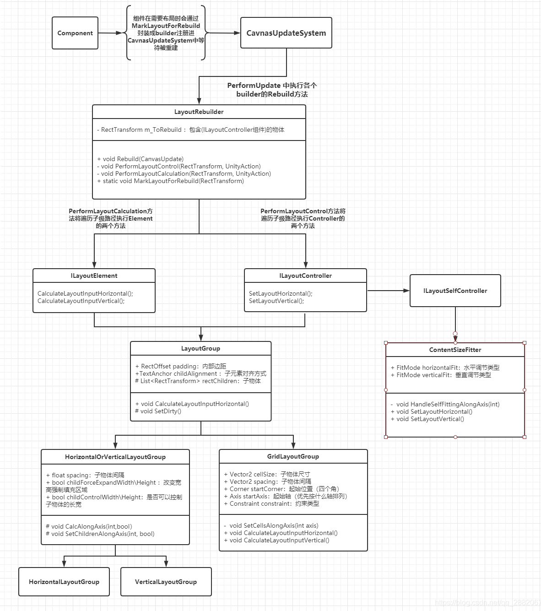

### UGUI-Layout




#### 一、LayoutSystem 布局系统

##### LayoutSystem

LayoutSystem是UGUI中由CanvasUpdateSystem发起（**m_LayoutRebuildQueue中大部分都是LayoutRebuilder**）的关于布局排列的处理系统。

- ILayoutElement：布局元素，布局的接收方，存储有关布局的信息
- ILayoutController：布局控制接口，布局的实施方，指定布局规则
- ILayoutIgnorer：忽略布局接口，忽略开关开启状态将忽略该物体的布局


##### LayoutRebuilder

**标记**

UGUI组件（如Graphic，ScrollRect...）在**需要布局处理**时会通过**标记**的方式将自身的RectTransform封装成一个LayoutRebuilder对象，添加进CanvasUpdateSystem的布局队列（LayoutRebuildQueue）中等待被重建。

``` c#
public static void MarkLayoutForRebuild(RectTransform rect)
{
    if (rect == null || rect.gameObject == null)
        return;

    var comps = ListPool<Component>.Get();
    bool validLayoutGroup = true;
    RectTransform layoutRoot = rect;
    var parent = layoutRoot.parent as RectTransform;
    // 从物体父级路径中寻找是否存在布局组件ILayoutGroup
    while (validLayoutGroup && !(parent == null || parent.gameObject == null))
    {
        validLayoutGroup = false;
        parent.GetComponents(typeof(ILayoutGroup), comps);

        for (int i = 0; i < comps.Count; ++i)
        {
            var cur = comps[i];
            if (cur != null && cur is Behaviour && ((Behaviour)cur).isActiveAndEnabled)
            {
                validLayoutGroup = true;
                layoutRoot = parent;
                break;
            }
        }

        parent = parent.parent as RectTransform;
    }

    // We know the layout root is valid if it's not the same as the rect,
    // since we checked that above. But if they're the same we still need to check.
    // 检查自身是否满足布局要求
    if (layoutRoot == rect && !ValidController(layoutRoot, comps))
    {
        ListPool<Component>.Release(comps);
        return;
    }

    // 添加进CanvasUpdateSystem中
    MarkLayoutRootForRebuild(layoutRoot);
    ListPool<Component>.Release(comps);
}

private static void MarkLayoutRootForRebuild(RectTransform controller)
{
    if (controller == null)
        return;
	// 生成一个rebuilder对象
    var rebuilder = s_Rebuilders.Get();
    rebuilder.Initialize(controller);
    // 将rebuilder对象注册进CanvasUpdate中，等待Canvas的重建命令
    if (!CanvasUpdateRegistry.TryRegisterCanvasElementForLayoutRebuild(rebuilder))
        s_Rebuilders.Release(rebuilder);
}
```

**重建**

当重建指令触发时，LayoutRebuilder将对自身及其子路径中的所有ILayoutElement与ILayoutController执行相应的接口。

``` c#
public void Rebuild(CanvasUpdate executing)
{
    switch (executing)
    {
        case CanvasUpdate.Layout:
            // It's unfortunate that we'll perform the same GetComponents querys for the tree 2 times,
            // but each tree have to be fully iterated before going to the next action,
            // so reusing the results would entail storing results in a Dictionary or similar,
            // which is probably a bigger overhead than performing GetComponents multiple times.
            PerformLayoutCalculation(m_ToRebuild, e => (e as ILayoutElement).CalculateLayoutInputHorizontal());
            PerformLayoutControl(m_ToRebuild, e => (e as ILayoutController).SetLayoutHorizontal());
            PerformLayoutCalculation(m_ToRebuild, e => (e as ILayoutElement).CalculateLayoutInputVertical());
            PerformLayoutControl(m_ToRebuild, e => (e as ILayoutController).SetLayoutVertical());
            break;
    }
}
```


##### 布局组件

虽然UGUI组件中有一些组件都继承了ILayoutElement接口（例如：Image，Text，ScrollRect，InputFiled），但他们并不会设计对接口方法的实现。这是因为这些组件主要是布局操作的接收方，只需要通过该接口被布局实施方所发现即可。而UGUI中负责这些接收物体的布局设置功能主要是由LayoutGroup衍生的子类组件完成。

#### 二、HorizontalOrVerticalLatyoutGroup（纵横布局组件）

##### LayoutGroup

布局系统的实施组件的基类（GridLayoutGroup、HorizontalOrVerticalLayoutGroup）。

##### HorizontalOrVerticalLayoutGroup

**属性**

- Padding：内部编剧，调整实际用于布局的大小
- Spacing：子物体直接的间隔
- Child Alignment：子物体的对齐方式
- Child Controls Size：组件控制子物体尺寸开关，开启时组件可以更改物体尺寸
- Child Force Expand：组件控制子物体填充区域开关，若可以修改尺寸则会改变子物体尺寸填充区域，若不可以修改尺寸，则根据区域大小均衡分布子物体

**布局过程**（以**HorizontalLayoutGroup**为例）

- 首先被执行的是ILayoutElement的CalculateLayoutInputHorizontal方法，该方法将收集其子节点下所有没有被标记ignoreLayout的物体（m_RectChildren）

``` c#
// HorizontalLayoutGroup
public override void CalculateLayoutInputHorizontal()
{
    base.CalculateLayoutInputHorizontal();
    CalcAlongAxis(0, false);
}
```

```c#
// LayoutGroup
public virtual void CalculateLayoutInputHorizontal()
{
    // 清空list，准备收集子节点下没有被ignoreLayout标记的物体
    m_RectChildren.Clear();
    var toIgnoreList = ListPool<Component>.Get();
    for (int i = 0; i < rectTransform.childCount; i++)
    {
        var rect = rectTransform.GetChild(i) as RectTransform;
        if (rect == null || !rect.gameObject.activeInHierarchy)
            continue;

        rect.GetComponents(typeof(ILayoutIgnorer), toIgnoreList);

        // 未标记ignoreLayout，将其收集
        if (toIgnoreList.Count == 0)
        {
            m_RectChildren.Add(rect);
            continue;
        }

        for (int j = 0; j < toIgnoreList.Count; j++)
        {
            var ignorer = (ILayoutIgnorer)toIgnoreList[j];
            if (!ignorer.ignoreLayout)
            {
                m_RectChildren.Add(rect);
                break;
            }
        }
    }
    ListPool<Component>.Release(toIgnoreList);
    m_Tracker.Clear();
}
```

- CalcAlongAxis主要是做LayoutGroup的一些初始化参数计算

``` c#
protected void CalcAlongAxis(int axis, bool isVertical)
{
    float combinedPadding = (axis == 0 ? padding.horizontal : padding.vertical);
    bool controlSize = (axis == 0 ? m_ChildControlWidth : m_ChildControlHeight);
    bool useScale = (axis == 0 ? m_ChildScaleWidth : m_ChildScaleHeight);
    bool childForceExpandSize = (axis == 0 ? m_ChildForceExpandWidth : m_ChildForceExpandHeight);

    float totalMin = combinedPadding;
    float totalPreferred = combinedPadding;
    float totalFlexible = 0;

    bool alongOtherAxis = (isVertical ^ (axis == 1));
    for (int i = 0; i < rectChildren.Count; i++)
    {
        RectTransform child = rectChildren[i];
        float min, preferred, flexible;
        GetChildSizes(child, axis, controlSize, childForceExpandSize, out min, out preferred, out flexible);

        if (useScale)
        {
            float scaleFactor = child.localScale[axis];
            min *= scaleFactor;
            preferred *= scaleFactor;
            flexible *= scaleFactor;
        }

        if (alongOtherAxis)
        {
            // 另一条轴的简单处理，取其中最大的子物体的值即可
            totalMin = Mathf.Max(min + combinedPadding, totalMin);
            totalPreferred = Mathf.Max(preferred + combinedPadding, totalPreferred);
            totalFlexible = Mathf.Max(flexible, totalFlexible);
        }
        else
        {
            // 目标轴处理，数值为子物体数值的累加
            totalMin += min + spacing;
            totalPreferred += preferred + spacing; //包括间隔

            // Increment flexible size with element's flexible size.
            totalFlexible += flexible;
        }
    }
	
    // 去掉多余的一次间隔
    if (!alongOtherAxis && rectChildren.Count > 0)
    {
        totalMin -= spacing;
        totalPreferred -= spacing;
    }
    totalPreferred = Mathf.Max(totalMin, totalPreferred);
    // 根据轴设置m_TotalMinSize、m_TotalPreferredSize、m_TotalFlexibleSize的值
    SetLayoutInputForAxis(totalMin, totalPreferred, totalFlexible, axis);
}
```

- 接着会执行ILayoutController的SetLayoutHorizontal方法。（这在GridLayoutGroup、HorziontalLayoutGroup、VerticalLayoutGroup中有不同的处理）

``` c#
// HorizontalLayoutGroup
public override void SetLayoutHorizontal()
{
    // 根据轴设置子物体的布局
    SetChildrenAlongAxis(0, false);
}
```

- 布局物体的方法主要是在**选择出目标边（Edge）**，**计算出距离（inset）**，**计算出子物体的大小（size）**。

```c#
protected void SetChildrenAlongAxis(int axis, bool isVertical)
{
    // 获取根坐标轴有关的设置
    float size = rectTransform.rect.size[axis];
    bool controlSize = (axis == 0 ? m_ChildControlWidth : m_ChildControlHeight);
    bool useScale = (axis == 0 ? m_ChildScaleWidth : m_ChildScaleHeight);
    bool childForceExpandSize = (axis == 0 ? m_ChildForceExpandWidth : m_ChildForceExpandHeight);
    float alignmentOnAxis = GetAlignmentOnAxis(axis);
	
    // 当两者不同时为true，例水平y轴，垂直x轴
    bool alongOtherAxis = (isVertical ^ (axis == 1));
    if (alongOtherAxis)
    {
        // 在水平或垂直布局中，另一条轴的布局操作相对简单
        // 实际尺寸，根据padding计算
        float innerSize = size - (axis == 0 ? padding.horizontal : padding.vertical);
        for (int i = 0; i < rectChildren.Count; i++)
        {
            RectTransform child = rectChildren[i];
            float min, preferred, flexible;
            // 获取子物体的尺寸，最小、合适、灵活尺寸
            GetChildSizes(child, axis, controlSize, childForceExpandSize, out min, out preferred, out flexible);
            float scaleFactor = useScale ? child.localScale[axis] : 1f;
			// 若强制填充，则会以该组件的尺寸来决定，反之则以子物体的最佳尺寸
            float requiredSpace = Mathf.Clamp(innerSize, min, flexible > 0 ? size : preferred);
            // 计算距离边的距离
            float startOffset = GetStartOffset(axis, requiredSpace * scaleFactor);
            if (controlSize)
            {
                // 根据轴选取矩形的边，以及距离、尺寸，设置子物体的位置
                SetChildAlongAxisWithScale(child, axis, startOffset, requiredSpace, scaleFactor);
            }
            else
            {
                float offsetInCell = (requiredSpace - child.sizeDelta[axis]) * alignmentOnAxis;
                SetChildAlongAxisWithScale(child, axis, startOffset + offsetInCell, scaleFactor);
            }
        }
    }
    else
    {
        // 起始位置：对于边的距离
        float pos = (axis == 0 ? padding.left : padding.top);
        float itemFlexibleMultiplier = 0;
        float surplusSpace = size - GetTotalPreferredSize(axis);

        if (surplusSpace > 0)
        {
            if (GetTotalFlexibleSize(axis) == 0)
                pos = GetStartOffset(axis, GetTotalPreferredSize(axis) - (axis == 0 ? padding.horizontal : padding.vertical));
            else if (GetTotalFlexibleSize(axis) > 0)
                itemFlexibleMultiplier = surplusSpace / GetTotalFlexibleSize(axis);
        }
        
		// 差值
        float minMaxLerp = 0;
        if (GetTotalMinSize(axis) != GetTotalPreferredSize(axis))
            minMaxLerp = Mathf.Clamp01((size - GetTotalMinSize(axis)) / (GetTotalPreferredSize(axis) - GetTotalMinSize(axis)));

        for (int i = 0; i < rectChildren.Count; i++)
        {
            RectTransform child = rectChildren[i];
            float min, preferred, flexible;
            GetChildSizes(child, axis, controlSize, childForceExpandSize, out min, out preferred, out flexible);
            float scaleFactor = useScale ? child.localScale[axis] : 1f;

            float childSize = Mathf.Lerp(min, preferred, minMaxLerp);
            childSize += flexible * itemFlexibleMultiplier;
            if (controlSize)
            {
                // 根据轴选取矩形的边，以及距离、尺寸，设置子物体的位置
                SetChildAlongAxisWithScale(child, axis, pos, childSize, scaleFactor);
            }
            else
            {
                float offsetInCell = (childSize - child.sizeDelta[axis]) * alignmentOnAxis;
                SetChildAlongAxisWithScale(child, axis, pos + offsetInCell, scaleFactor);
            }
            // 更新距离，累计子物体尺寸与间隔
            pos += childSize * scaleFactor + spacing;
        }
    }
}
```

#### 三、GridLayoutGroup（网格布局组件）与ContentSizeFitter（尺寸调节组件）

##### GridLayoutGroup

布局系统中的网格布局组件，不同于纵横布局，网格布局中严格要求了对子物体尺寸的设置。

**属性**

- Padding：内部编剧，调整实际用于布局区域的大小
- Cell Size：子物体尺寸，设置被布局物体的尺寸
- Spacing：子物体直接的间隔
- Start Corner：起始位置，子物体起始放置的位置（四个角）
- Start Axis：起始轴，优先按照横向/纵向排列
- Child Alignment：子物体的对齐方式
- Constraint：约束类型，可以限制行列数

**布局过程**

- 执行CalculateLayoutInputHorziontal方法

```c#
public override void CalculateLayoutInputHorizontal()
{
    // LayoutGroup 基类方法
    base.CalculateLayoutInputHorizontal();
	
    // 若对排列有约束限制，则初始化设置参数
    // 因为是横轴所以只获取列数的限制
    int minColumns = 0;
    int preferredColumns = 0;
    if (m_Constraint == Constraint.FixedColumnCount)
    {
        minColumns = preferredColumns = m_ConstraintCount;
    }
    else if (m_Constraint == Constraint.FixedRowCount)
    {
        minColumns = preferredColumns = Mathf.CeilToInt(rectChildren.Count / (float)m_ConstraintCount - 0.001f);
    }
    else
    {
        minColumns = 1;
        preferredColumns = Mathf.CeilToInt(Mathf.Sqrt(rectChildren.Count));
    }

    // 同HorizontalOrVerticalLayoutGroup组件，设置参数
    SetLayoutInputForAxis(
        padding.horizontal + (cellSize.x + spacing.x) * minColumns - spacing.x,
        padding.horizontal + (cellSize.x + spacing.x) * preferredColumns - spacing.x,
        -1, 0);
}
```

- GridLayoutGroup的布局实现原理上与HorizontalOrVerticalLayoutGroup相同，依靠`SetChildAlongAxisWithScale`方法实现子物体的尺寸与位置的设置。

```c#
// 执行两条轴的布局
public override void SetLayoutHorizontal()
{
    SetCellsAlongAxis(0);
}

public override void SetLayoutVertical()
{
    SetCellsAlongAxis(1);
}
```

- 根据设置的参数计算出**startOffset（初始位置），cellSize+spacing（尺寸+间隔）** 对子物体进行设置。

``` c#
private void SetCellsAlongAxis(int axis){
    ...
    for (int i = 0; i < rectChildren.Count; i++)
	{
        ...
        SetChildAlongAxis(rectChildren[i], 0, startOffset.x + (cellSize[0] + spacing[0]) * positionX, cellSize[0]);
        SetChildAlongAxis(rectChildren[i], 1, startOffset.y + (cellSize[1] + spacing[1]) * positionY, cellSize[1]);
	}
}
```


##### ContentSizeFitter

布局系统中尺寸调节组件，适用于调整组件区域使其自适应的组件，一般用于与ScrollRect滑动列表以及纵横布局组件搭配，实现动态数量的滑动列表效果，以及与Text组件一起使用，可以根据文字长短进行区域尺寸的变化。

ContentSizeFitter继承了ILayoutSelfController接口（ILayoutController的衍生），和LayoutGroup一般被布局系统所处理。而和LayoutGroup不同的地方在于，ContentSizeFitter不改变子物体的大小和位置，而是根据子物体（ILayoutElement）来改变**自身的尺寸**。

**属性**

- Horizontal Fit：水平适应
- Vertical Fit：垂直适应

三种类型：非强制、最小尺寸适应、最佳尺寸适应

**实现过程**

- Enable阶段设置布局标记，来触发Rebuild。

```C#
protected override void OnEnable()
{
    base.OnEnable();
    SetDirty();
}

protected void SetDirty()
{
    if (!IsActive())
        return;
    
	// 封装成LayoutRebuilder等待被重建
    LayoutRebuilder.MarkLayoutForRebuild(rectTransform);
}
```

- Canvas触发重建过程，其封装的LayoutRebuilder执行了Rebuild方法。CoteneSizeFitter自身并没有继承ILayoutElement，所以跳过Rebuild的CalculateLayoutHorizontal/Vertical部分，直接执行它的SetLayoutHorizontal/Vertical接口方法。

```c#
public virtual void SetLayoutHorizontal()
{
    m_Tracker.Clear();
    // 根据轴进行尺寸改变
    HandleSelfFittingAlongAxis(0);
}

public virtual void SetLayoutVertical()
{
    HandleSelfFittingAlongAxis(1);
}
```

```c#
private void HandleSelfFittingAlongAxis(int axis)
{
    // 获取目标轴的适应类型
    FitMode fitting = (axis == 0 ? horizontalFit : verticalFit);
    // 不强制的类型时不会进行尺寸改变
    if (fitting == FitMode.Unconstrained)
    {
        // Keep a reference to the tracked transform, but don't control its properties:
        m_Tracker.Add(this, rectTransform, DrivenTransformProperties.None);
        return;
    }

    // 添加Tracker的部分无法被修改
    m_Tracker.Add(this, rectTransform, (axis == 0 ? DrivenTransformProperties.SizeDeltaX : DrivenTransformProperties.SizeDeltaY));

    // Set size to min or preferred size
    // 根据类型选择适应的尺寸
    if (fitting == FitMode.MinSize)
        rectTransform.SetSizeWithCurrentAnchors((RectTransform.Axis)axis, LayoutUtility.GetMinSize(m_Rect, axis));
    else
        rectTransform.SetSizeWithCurrentAnchors((RectTransform.Axis)axis, LayoutUtility.GetPreferredSize(m_Rect, axis));
}
```

ContentSizeFitter主要依靠LayoutUtility.GetMinSize与LayoutUtility.GetPreferredSize实现尺寸的变化，这两个方法会从物体自身寻找ILayoutElement，从中获取minWidth与preferredWidth，不存在则返回默认值0。

**※** 因为ConteneSizeFitter自身并未继承ILayoutElement，所以仅仅只有ContentSizeFitter时会将尺寸变为0。添加**LayoutElement**组件，并设置**Prefered Size**即可看见变化。