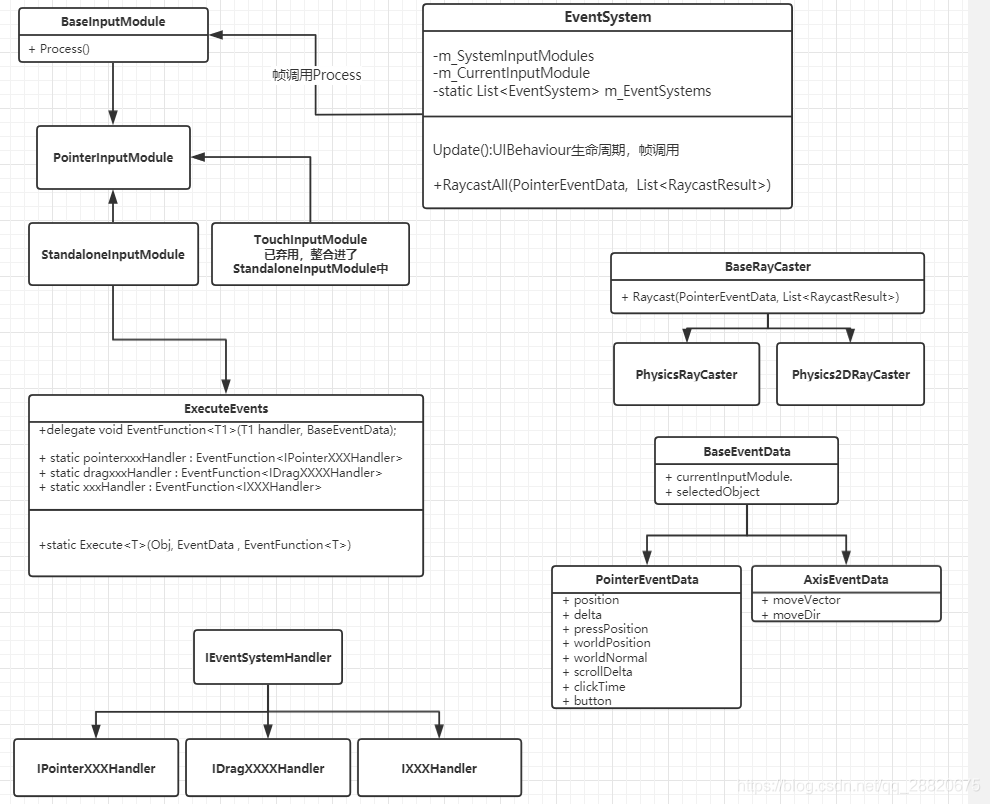
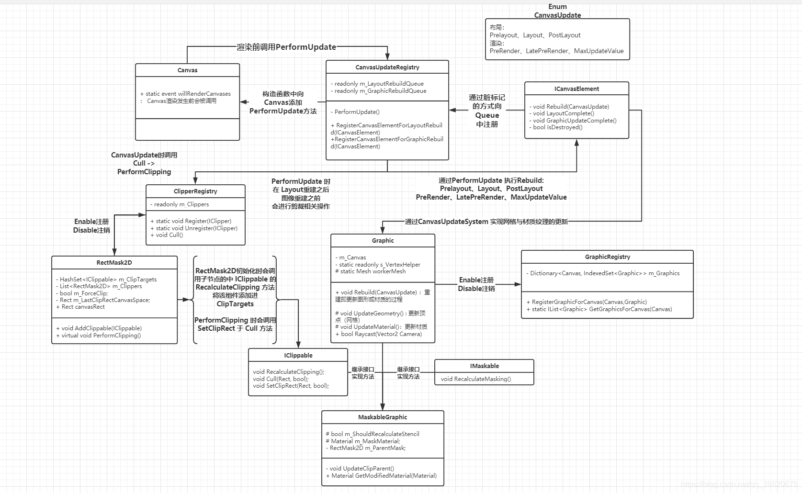
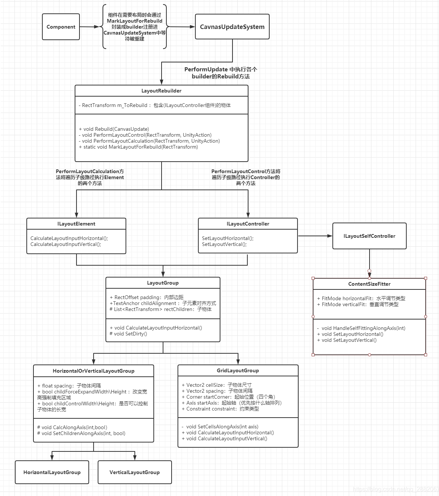

## Unity UGUI 指南

### 一、UGUI主要结构与工作原理

#### 1. EventSystem





**工作原理**：管理**输入检测模块（InputModule）**并**帧调用**Module的**执行（Process）**。调用**射线捕捉模块（Raycasters）**，为InputModule提供结果（具体的出点所穿透的对象信息）。InputModule管理更新EventData**判断当前的操作事件**，并通知具体的**EventSystemHandler**进行逻辑处理。

- **InputModule**

    **输入检测模块**。被EventSystem帧调用，检测Input中各项数值来判断当前操作状态，更新/创建PointerEventData。根据操作状态去执行对应方法，满足条件则执行相应事件（ExecuteEvent）。

    **注意**：当前项目中采用新的输入检测模块InputSystemUIInputModule。

- **Raycasters**

    **射线捕捉模块**，在事件系统中利用、管理射线捕捉物体。

    **RaycasterManager**

    管理一个RaycasterList，通过EventSystem.RaycastAll提供给InputModule

    **Physics2DRaycaster/PhysicsRaycaster**

    分别使用Physics2D/Physics中射线穿透取交点信息的方法

    **Raycast过程**

    ``` c#
    // InputSystemUIInputModule.cs
    private void ProcessPointer(ref PointerModel state){
        // .. 检测当前状态未改变，直接返回
        
        var pointerType = eventData.pointerType;
        // .. 根据指针类型，记录当前事件位置信息
    	
        // 在当前位置做一次射线检测
        eventData.pointerCurrentRaycast = PerformRaycast(eventData);
    }
    
    private RaycastResult PerformRaycast(ExtendedPointerEventData eventData){
        if (...) {
            
        }
        
        // 如果事件指针类型不是跟踪类型,跳过上一部分，直接RaycastAll
        eventSystem.RaycastAll(eventData, m_RaycastResultCache);
    }
    
    // EventSystem.cs
    public void RaycastAll(PointerEventData eventData, List<RaycastResult> raycastResults){
        // 遍历InputModule，执行Raycast
        module.Raycast(eventData, raycastResults);
    }
    
    // PhysicsRaycaster.cs
    public override void Raycast(PointerEventData eventData, List<RaycastResult> resultAppendList){
        // 计算射线与距离
        if (!ComputeRayAndDistance(eventData, ref ray, ref displayIndex, ref distanceToClipPlane))
            return;
        
        m_Hits= ReflectionMethodsCache.Singleton.raycast3DAll(ray,...); // 通过射线获取物体信息
        
        // 遍历m_Hits物体信息，将数据封装提供给EventSystem
        var result = new RaycastResult{...};
        resultAppendList.Add(result);
    }
    
    protected bool ComputeRayAndDistance(PointerEventData eventData, ref Ray ray, ref int eventDisplayIndex, ref float distanceToClipPlane){
        var eventPosition = Display.RelativeMouseAt(eventData.position); // 获取eventPosition
        // ...
        ray = eventCamera.ScreenPointToRay(eventPosition); // 获取射线
    }
    ```
    
    
    
    - `eventSystem.RaycastAll(pointerData, m_RaycastResultCache); // InputModule检测到了点击/触摸，并向EventSystem请求数据`
    - `module.Raycast(eventData, raycastResults); // EventSystem响应InputModule的请求，启动射线获取数据`
    - `ray = eventCamera.ScreenPointToRay(eventData.position); // 通过位置信息获取射线`
    - `m_Hits= ReflectionMethodsCache.Singleton.raycast3DAll(ray,...); // 通过射线获取物体信息`
    - `var result = new RaycastResult{...}; resultAppendList.Add(result); 将所有数据进行封装提供给EventSystem`
    
- **ExecuteEvents**

    ``` c#
public static bool Execute<T>(GameObject target, BaseEventData eventData, EventFunction<T> functor) where T : IEventSystemHandler{
        GetEventList<T>(target, internalHandlers); // 获取物体上所有包含IEventSystemHandler且可用的组件
    
        // 遍历所有IEventSystemHandler组件，执行functor
        functor(arg, eventData);
    }
    ```
    
    
    
    - `GetEventList<T>(target, internalHandlers); // 获取物体上所有包含IEventSystemHandler且可用的组件`
    
    - `arg = (T)internalHandlers[i]; // 找到具体T类型组件`
    
    - `functor(arg, eventData); // 执行`

#### 2. Graphic





**工作原理**：**Graphic**作为图像组件的基类，主要实现了**网格**与**图像**的生成/刷新方法。在生命周期Enable阶段、Editor模式下的OnValidate中，**层级/颜色/材质**改变时都会进行相应的**重建**，被**标记**后会被加入**CanvasUpdateRegistry**的**布局重建队列**与**图像重建队列**中，等待重建，最终在Canvas渲染时被渲染成图像。

- **CanvasUpdate**

    画布刷新系统

    **Canvas**

    Canvas渲染前会调用`static event willRenderCanvases`事件

    **CanvasUpdateRegistry**

    管理两个队列：

    - LayoutRebuildQueue：布局重建队列
    - GraphicRebuildQueue：图像重建队列

    Canvas在渲染前会调用willRenderCanvases，即执行PerformUpdate，流程如下：

    - **更新布局**
    - 通知布局更新完成
    - **ClipperRegistry进行剪裁**

    - **更新图像**
    - 通知图像更新完成


- **Graphic**

    Graphic中的重建主要分为两个部分：**顶点重建（UpdateGeometry）**与**材质重建（UpdateMaterial）**

    **Rebuild**

    进行顶点重建与材质重建

    **UpdateGeometry**

    Graphic顶点（网格）更新，发生**顶点重建**时会被调用

    - 更新VertextHelper数据
    - 遍历身上的IMeshModifier组件，更新VertextHelper数据
    - 将最终的顶点数据设置给workerMesh，并将workerMesh设置进canvasRenderer中，进行渲染

    **UpdateMaterial**

    Graphic材质更新，发生**材质重建**时会被调用

    - 获取自身材质material，遍历身上的IMaterialModifier组件，更新materialForRendering
    - 将最终的材质数据materialForRendering与纹理mainTexture设置进canvasRenderer中，进行渲染

- **Mask**

    MaskableGraphic在Graphic的基础上实现了剪裁与遮罩功能。

    **RectMask2D 矩形剪裁**

    - 当Canvas进行刷新时，会调用所有启用中的IClipper，执行Cull操作，遍历执行IClipper.PerformClipping

    - **PerformClipping**：更新IClippable中用于剪裁的Rect

        `maskableTarget.SetClipRect(cliRect, validRect) // MaskableGraphic中设置裁剪框`

        `maskableTarget.Cull(clipRect, validRect) // 进行裁剪`

    **MaskableGraphic**

    - 当Enable时，若该物体自身含有Mask组件则会调用其子节点路径下所有IMaskable组件方法
    - 在**Graphic材质重建**的过程中调用其上所有IMaterialModifier组件方法来处理最终的材质渲染materialForRendering

#### 3. Layout





**工作原理**：UGUI组件（如Graphic，ScrollRect...）在**需要布局处理**时会通过**标记**的方式将自身的RectTransform封装成一个**LayoutRebuilder**对象，添加进CanvasUpdateSystem的**布局队列（LayoutRebuildQueue）**中等待被重建，重建时将执行**ILayoutElement**与**ILayoutController**相应的接口。

- **LayoutRebuilder**

    **标记**

    - MarkLayoutForRebulid：
        - 从物体父级路径中寻找是否存在布局空间ILayoutGroup
        - 检擦自身是否满足布局要求
        - 添加进CanvasUpdateSystem中（MarkLayoutRootForRebuild）
    - MarkLayoutRootForRebuild：
        - 生成一个rebulider对象
        - 将rebuilder对象注册进CanvasUpdate中，等待Canvas重建

    **重建**

    当重建指令触发时，LayoutRebuilder将对自身及其子路径中的所有ILayoutElement与ILayoutController执行相应的接口。

- **HorizontalOrVerticalLayoutGroup**

    **布局过程**（以**HorizontalLayoutGroup**为例）

    - 首先被执行的是ILayoutElement的CalculateLayoutInputHorizontal方法，该方法将收集其子节点下所有没有被标记ignoreLayout的物体（m_RectChildren）

    - 接着会执行ILayoutController的SetLayoutHorizontal方法

    - 布局物体的方法主要是在**选择出目标边**，**计算出距离**，**计算出子物体的大小**

        `SetChildAlongAxisWithScale(child, axis, pos, childSize, scaleFactor); // 根据轴选取矩形的边，以及距离、尺寸，设置子物体的位置`

- **GridLayoutGroup**

    布局系统中的网格布局组件，不同于纵横布局，网格布局中严格要求了对子物体尺寸的设置。

    **布局过程**

    - 执行CalculateLayoutInputHorziontal方法
    - GridLayoutGroup的布局实现原理上与HorizontalOrVerticalLayoutGroup相同，依靠`SetChildAlongAxisWithScale`方法实现子物体的尺寸与位置的设置
    - 根据设置的参数计算出**startOffset（初始位置），cellSize+spacing（尺寸+间隔）** 对子物体进行设置

- **ContentSizeFitter**

    布局系统中尺寸调节组件，适用于调整组件区域使其自适应的组件。ContentSizeFitter不改变子物体的大小和位置，而是根据子物体（ILayoutElement）来改变**自身的尺寸**。

    **实现过程**

    - Enable阶段设置布局标记，来触发Rebuild

    - Canvas触发重建过程，其封装的LayoutRebuilder执行了Rebuild方法。CoteneSizeFitter自身并没有继承ILayoutElement，所以跳过Rebuild的CalculateLayoutHorizontal/Vertical部分，直接执行它的SetLayoutHorizontal/Vertical接口方法

    - 根据类型选择合适的尺寸。ContentSizeFitter主要依靠LayoutUtility.GetMinSize与LayoutUtility.GetPreferredSize实现尺寸的变化，这两个方法会从物体自身寻找ILayoutElement，从中获取minWidth与preferredWidth，不存在则返回默认值0

        ``` c#
        if (fitting == FitMode.MinSize)
                rectTransform.SetSizeWithCurrentAnchors((RectTransform.Axis)axis, LayoutUtility.GetMinSize(m_Rect, axis));
            else
                rectTransform.SetSizeWithCurrentAnchors((RectTransform.Axis)axis, LayoutUtility.GetPreferredSize(m_Rect, axis));
        ```

    **※** 因为ConteneSizeFitter自身并未继承ILayoutElement，所以仅仅只有ContentSizeFitter时会将尺寸变为0。添加**LayoutElement**组件，并设置**Prefered Size**即可看见变化。

#### 4. Component

**工作原理**：UGUI的重要组成部分，是EventSystem的**具体接收方**。其中大部分为Selectable的组件，在**输入检测模块（InputModule）**检测到操作后，Selectable会根据操作类型进行不同的响应，**导航（Navigation）**、**过渡（Transition）**与**事件响应**，但Selectable对事件响应没有做太多处理，具体对事件的处理交给了它的**子类们**。

- **Selectable**

    **导航（Navigation）**

    导航有五种类型可供选择：

    - None： = 0，无导航
    - Horizontal： = 1， 自动地水平方向导航
    - Vertical：= 2，自动得垂直方向导航
    - Automatic：= 3，自动两个维度地导航
    - Explicit：= 4，自定义各个方向地导航目标

    1. 当无导航时：不会成为别的导航目标，自身也不会导航其他物体

    2. 当处于水平、垂直、二维导航时：目标会根据距离来确定导航上下左右的导航目标（水平只有左右，垂直只有上下）

    3. 当处于自定义时：可以自己选择上下左右所导航的目标

    **过渡（Transition）**

    状态过渡有四种类型可供选择：

    - None：无
    - ColorTint：颜色变化，通过Graphic中的CrossFadeColor方法改变颜色，是通过TweenRunner来实现协程动画的
    - SpriteSwap：Sprite图像变化，将新图像设置给Image
    - Animation：动画变化，执行Animator的Trigger操作

    当Selectable状态改变时，会改变其状态相关属性（颜色、图像、动画），并执行对应过渡。

- **Image & RawImage**

- **Text & TMP**

- **Button**

- **Toggle**

- **Slider**

- **Scrollbar & ScrollRect**

- **Dropdown**

- **InputField**

### 二、UGUI性能相关

#### 1. Rebuild

重建。Rebuild是相当消耗性能的一部分，Rebuild的过程中主要分为**顶点重建**与**材质重建**，频繁的Rebuild以及顶点数量过多都会消耗大量的性能。

**何时Rebuild？**

当布局为dirty时，即标记需要重建时，这时会触发Rebuild。而当UI中的一些物体位置、大小、颜色、材质等发生变化时，这时需要重建，因此会将自己标记为dirty，进行重建。所以应尽量减少UI的动态变化可以有效减少Rebuild的次数，从而提升性能。

**顶点数量**

顶点数量的多少与这次Rebuild所耗时长直接相关，顶点数量越多，一次Rebuild消耗的性能就越大，时间也就越长。因此降低UI的顶点数量也可以有效优化Rebulid，例如在为Text添加特效时，Shadow与Outline特效分别会将一个UI的顶点数**增加1倍**与**增加4倍**，应改用TextMeshPro组件来完成特效。

#### 2. Batching

合批。Canvas在渲染之前会进行合批，将材质相同或都在同一图集中的UI进行合批，减少多余的DrawCall，以提升性能

**合批流程**

- 遍历UI
- 合批测试：当前UI会判断该元素底部是否有物体，如果没有则Depth为0，如果盖住物体则Depth等于底部盖住的UI元素中Depth最大的值 + 1
- 如果两个相邻元素通过了合批测试，则这两个相邻元素的Depth相等
- 排序：如果深度一致，判断材质是否一直，在判断图片是否一致，最后再根据面板RendererOrder排序，如果深度为-1，则不渲染
- 得到排序数组，看相邻元素是否一致，进行合批

在合批工程中如果这两个UI的MatID和ImgID都相同，但是不连续，中间有其他不同MatID或ImgID的UI则会打断合批。

**影响合批的操作**

- 如果这两个UI的MatID和ImgID都相同，但是不连续，中间有其他不同MatID或ImgID的UI则会打断合批。因此因尽量不要在可以合批的UI中间添加中间层。
- 当可以与下方进行合批的物体，此时刚好遮挡上方物体时，也会中断合批。因此应尽量减少UI覆盖的操作。
- 在每次的Rebuild过程中也会进行重新合批，因此尽量减少Rebuild次数，也会减少合批的性能消耗。
- Mask影响合批
    - 因为Mask会为MaskUI增加一个新的材质，导致mask内物体无法与外部同样材质的物体合批。
    - Mask有2个DrawCall（设置模板和还原模板），Mask与Mask之间可以合批，Mask内部可以合批。
    - 被mask的物体只是不被绘制，依旧会影响合批计算，容易发生第二点提到的问题。

#### 3. Raycast

射线检测。每次输入事件触发同时会触发一次RaycastAll，调用射线捕捉模块，GraphicRaycaster找到其下所有勾选了RaycasterTarget且active的Graphic，是的话沿着层级向上遍历，对实现了ICanvasRaycastFilter的节点检查命中，直到没有父节点或者走到勾选了overrideSorting的UI，将命中的节点全部加入列表，为InputModule提供结果。

由此看出不需要Raycast的UI建议把RaycasterTarget关闭，以及尽量将RaycasterTarget放在根节点，使用overrideSorting打断射线，以减少RaycastAll的性能消耗。

#### 4. Overdraw

过度绘制。理论上在一帧的时间内一个像素被绘制一次时最优的，但是由于重叠的布局导致一些像素会被多次绘制，因此造成浪费，导致过度绘制。所以尽量简化布局层级，移除不必要的背景等都是提升渲染性能的方式。

### 三、UGUI优化相关

#### 1. 动静分离

如果Canvas下的UI元素过多，会导致大量UI元素在合批过程中的分析、排序开销过大，且Canvas一旦有改动，哪怕只是一个UI元素的变动，Canvas还是会进行一次重建。因为每个Canvas只负责自身的重建与合批，所以应当尽量将动态UI与静态UI分离到不同的Canvas，但也不宜过多，因为Canvas之间是不会进行合批的。经常改变的UI，例如进度条，生命值，资源数量等应当放置在动态Canvas中，静态不会改变的UI，例如背景、边框等应当放在静态Canvas中，这样前者的刷新就不会影响后者。

#### 2. Cavans事件相机添加缓存

```c#
// GrapichRaycaster
public override Camera eventCamera
{
    get
    {
        if (canvas.renderMode == RenderMode.ScreenSpaceOverlay || (canvas.renderMode == RenderMode.ScreenSpaceCamera && canvas.worldCamera == null))
            return null;

        return canvas.worldCamera != null ? canvas.worldCamera : Camera.main;
    }
}
```

可以看到当获取事件相机时，并没有对相机进行缓存，而是每次都通过Camera.main去获取主相机。可以通过继承GraphicRaycaster来覆盖eventCamera属性，对事件相机做缓存。

#### 3. UI合批工具

编写一个UI辅助合批工具，右键菜单自动优化层级，将可以合批的UI元素自动排列好顺序，减少手动排布UI所引发的中断合批。

### 四、UGUI使用注意事项

#### 1. 程序注意事项

- 使用Mask会产生额外2个drawCall，但Mask之间可以合批；使用RectMask2D不产生额外drawCall，但RectMask2D之间不能合批。其内部UI均不能与外部UI进行合批。
- 不要使用Unity的Outline与Shadow组件，改用TextMeshPro实现这两种功能。
- 不需要接收点击事件的UI把RayCastTarget关闭，以减少事件响应。
- 频繁需要隐藏的UI，建议使用CanvasGroup组件，将UI透明，少用Disable与Enable，否则Canvas将会重建。
- 可以合批的UI中间不要放置中间层，将其他UI尽量置于合批UI的下方。
- 动静分离，将静态UI与动态UI分离到不同的Canvas中。
- Canvas的的渲染相机不要为空。
- UI层级应尽量简单，且较少改动。
- 当有覆盖全屏的UI时，可以关闭不可见的摄像机，例如游戏场景的摄像机。

#### 2. 策划注意事项

- 在设计UI时，应尽量简单，层级不宜过于复杂。
- UI之间不应产生重叠、覆盖。

#### 3. 其他注意事项

- 在设置字体时，应将文字与周围UI保有一定的距离，以防覆盖其他UI。
- UI可的Shader可以采用简单的自定义Shader。