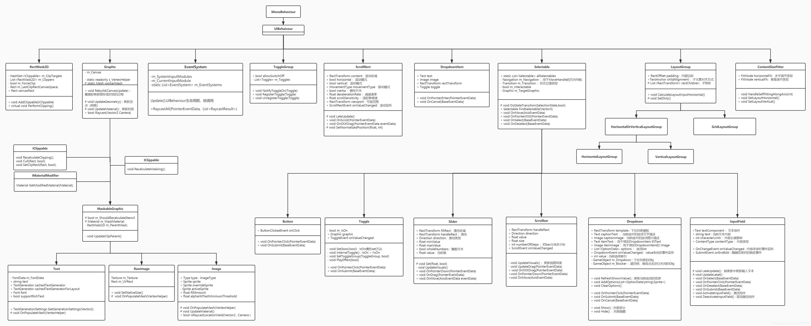

## Unity UGUI

Unity UGUI 主要以下四个部分来组成，**EventSystem事件系统**，**Graphic绘图系统**，**Layout布局系统**与**Component各种组件**。

### 一、UGUI EventSystem

[UGUI-EventSystem详解](UGUI-EventSystem.md)

### 二、UGUI Graphic

[UGUI-Graphic详解](UGUI-Graphic.md)

### 三、UGUI Layout

[UGUI-Layout详解](UGUI-Layout.md)

### 四、Component

[UGUI-Component详解](UGUI-Component.md)
